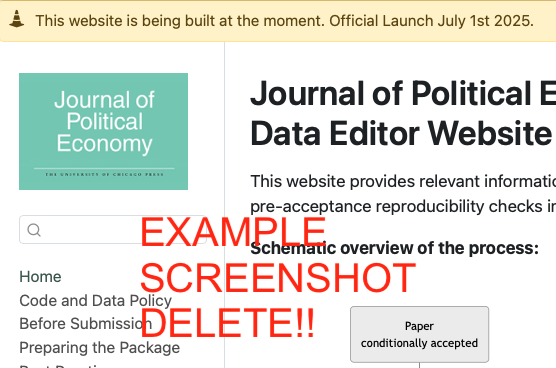

# Paper Identification

|  |   |
| ---  |  -------|
| ID  |   |
| Author  |   |
| Title  |   |
| Iteration |   |


> {REPLICATOR} Every line which looks like this one, that is, it starts with {REPLICATOR} and has this formatting (there is a grey bar on the left 👀), is an **instruction for the replicator**. When you are done with editing this file, _there should be no such line left_ - you should delete all of them.

> {REPLICATOR} Next to {REPLICATOR} for you, the replicator, there are instructions for the authors/data editor. Those are labelled either {REQUIRED} or {SUGGESTED}. You should delete those *only if specifically instructed*.

> {REPLICATOR}: You should look at additional [Step by step guidance from Data Editor for Replicators](https://jpe-reproducibility.github.io/jpereplicators)

::: {.callout-tip}

# {Replicator}: Glossary (delete this before you submit your report!)

_A brief explanation of important terms, before we start!_

1. Dropbox: a location where authors upload their package and where the journal office uploads pdfs of paper and appendix. You download the package from there via the URL contained in your assignment email.
2. `gh`: Github.com.
3. Github Repository (_repo_): The location on `gh` where we store the _code_ of a given package (not the data!). It is also the location where you should file an issue tagging `@jpedataeditor` in the text, in case you encounter any problems or have questions. The github repo associated with this package was in your assignment email for this package. Let me print it here again for you (keep a browser tab open): []()
4. `round`: the iteration number of this package. Notice that on the repo, each iteration has their own branch. Notice that you start on `round1`.
5. manuscript/paper: The PDFs of accepted paper and appendices, which we want to verify. You should copy both paper and appendix into the root of this repo

:::


Some useful information up front:

- [JPE Data and Code Availability Policy](https://www.journals.uchicago.edu/journals/jpe/datapolicy)
- [Step by step guidance from Data Editor for Authors](https://jpedataeditor.github.io/) 
- [Template README](https://social-science-data-editors.github.io/template_README/)


> {REPLICATOR} the file you are looking at lives in a git repository on your computer. You should place the repository in a location on your computer where you have read and write access (I would not put it on any cloud storage to avoid issues). 


> {REPLICATOR} you will edit _this_ file (`./TEMPLATE.qmd`). It is the source of your report. The package of the authors lives in folder `replication-package/`. We call the lowest level of this repo (marked by the dot `.` in `./TEMPLATE.qmd`) the _root of the repo_. Do not get confused if the authors talk about the _root of their package_, which would be location `./replication-package/` in this case.


# Summary

> {REPLICATOR} **The Data Editor** will fill this part out. It will be based on any {REQUIRED} and {SUGGESTED} action items that the report makes a note of.


In assessing compliance with our [Data and Code Availability Policy](https://www.journals.uchicago.edu/journals/jpe/datapolicy), our reproducibility team has identified the following issues, which we ask you to address:

1. Data Editor's first point.
2. Data Editor's second point.

# General


> {REPLICATOR} Check off the following sections/elements that you find in either the README provided by the authors, or in the authors' online appendix (rare).

- [ ] Data Availability and Provenance Statements
  - [x] Statement about Rights - Part 1: Right to use the data (e.g. *did the authors lawfully obtain the data*)
  - [x] Statement about Rights - Part 2: Right to publish the data (e.g. *are human subjects involved and did permission been granted to publish their data?*)
  - [ ] License for Data (optional, but recommended)
  - [x] Details on each Data Source
- [x] Dataset list
- [x] Computational requirements
  - [x] Software Requirements
  - [ ] Controlled Randomness (as necessary)
  - [x] Memory, Runtime, and Storage Requirements
- [ ] Description of programs/code
  - [ ] License for Code (Optional, but recommended) 
- [x] List of tables and programs
- [ ] References (Optional, but recommended) 


# High-level Description of Research Project

> {REPLICATOR} Tick all applicable boxes. You tick a box by placing an `x` between the square brackets (don't change anything else).

*This research project...*

- [x] uses observational data.
- [x] uses *confidential* observational data.
- [ ] uses data generated via experiment or trial by the authors (in field or lab).
  - [ ] For lab experiments: The code to implement the experimental protocol (z-Tree, o-Tree etc) is included in the package.
  - [ ] A PDF copy of IRB approval is contained in the package.
  - [ ] A PDF document outlining the design of the experiment, including information on the selection and eligibility of participants is included.
  - [ ] A PDF copy of the instructions given to participants in both original language and an English translation is included.
- [ ] uses data generated via survey by the authors (in field or online)
  - [ ] The programs used to administer the survey (e.g. qualtrics survey file) are included.
  - [ ] A PDF copy of IRB approval is contained in the package.
  - [ ] A PDF of the original questionaire(s) and information on the selection and eligibility of participants is included.
- [ ] is a simulation study: the data are generated by an algorithm.
- [ ] is a numerical illustration: no data are used but code is used to produce illustrative output (tables, figures)


# Data description

For any data that cannot be provided as part of the replication package, please provide the following information as part of the README.

> {REQUIRED}  Please specify how long the data will be preserved in the restricted-access location.

> {REQUIRED} Please provide affirmation of support for replication checks.
  - As per the [JPE policy](https://jpedataeditor.github.io/policy.html), "In cases where data cannot be published in an openly accessible trusted data repository like the JPE dataverse, authors who have requested an exemption to publish them at the time of first submission must commit to preserving the data and code for a period of no less than five years following the publication of the paper. They should also provide reasonable assistance to requests for clarification and replication."


> {REQUIRED} Please provide a codebook for the data.
  - The codebook should at a minimum describe the variables obtained from the data source, in a manner that will let others verify that they have obtained a substantially similar dataset if successfully obtaining access to the data.


## Data Sources

The table lists original input data sources, not every derived analysis-ready file. "Public" refers to whether the original source data are included in the public replication package. "Private" refers to whether the original source data were separately supplied to the replicator for checking.

| source | public | private | DOI/URL | access described | codebook/info | summary stats | cited README | cited paper |
| ---- | --- | --- | --- | --- | --- | --- | --- | --- |
| Transaction-level CDR: calls, SMS, data usage, shortcode calls | no; synthetic 5-row files only | no | no | partial: legal agreement and privacy restrictions described, but no access path | partial: synthetic schemas only | yes: paper text and Appendix Tables A5-A6 | no data citation | no data citation |
| Individual-quarter CDR panel | no; synthetic file only | no | no | partial: same CDR restrictions | partial: synthetic schema only | yes: Appendix Table A6 Panel E | no data citation | no data citation |
| Household survey microdata on religious practices | no; synthetic file and aggregate counts only | no | no | partial: described as confidential; no access path | partial: synthetic schema and aggregate response counts only | yes: Appendix Table A6 Panel A | no; article only | no; article only |
| Cell tower coordinates / antenna geolocation | no; synthetic tower file only | no | no | partial: confidential/privacy restriction described | partial: synthetic schema only | partial: tower counts in paper; no variable summaries | no data citation | no data citation |
| ISAF SIGACTS violence data | yes: `Data/figures_data/sigacts_afghanistan.csv` and classification crosswalk | yes | yes: [SIGACTS file][sigacts] | public link provided | yes: package codebook and classification crosswalk | yes: paper incident counts and Appendix Table A5 Panel A | yes | yes; URL footnote |
| ERA5-Land-based SPEI climate data | no; derived grid-month/year variables only | no | yes: [ERA5-Land article DOI][era5] | no specific data-access instructions beyond citation | derived variables only | yes: Appendix Table A5 Panels B-C | yes | yes |
| MODIS MOD13A3 EVI | no; derived EVI measure only | no | yes: [MODIS data DOI][modis] | public DOI provided | derived variable only | yes: Appendix Table A5 Panel C | yes | no; paper cites Asher and Novosad method only |
| FAO Afghanistan land cover / irrigation | no; derived land shares only | no | yes: [FAO metadata URL][fao] | public URL provided | derived variables only | yes: Appendix Table A5 Panel D | yes | yes |
| UNODC district-year poppy cultivation | no; derived poppy variables only | no | yes: [UNODC report URL][unodc] | report URL provided | derived variables only | yes: Appendix Table A6 Panel F | yes | yes |
| ACSOR district accessibility scores | no; derived accessibility variables only | no | yes: [ACSOR homepage][acsor] | no dataset-specific access conditions; homepage only | derived variables only | yes: Appendix Table A6 Panel B | yes | yes |
| PIX Taliban territorial-control data | no; derived indicator only | no | yes: [PIX][pix] | URL resolves to a login page | derived variable only | yes: Appendix Table A6 Panel D | yes | yes |
| Village-level language / ethnicity data compiled by AIMS, CSO, USAID, and Yale | no; derived ethnicity shares only | no | no | no access conditions | derived variables only | yes: Appendix Table A6 Panel D | no data citation | partial: source named, no data citation |
| AIMS Afghanistan district boundaries | yes: `Data/figures_data/district_shp/district398.*` | no | no author-provided URL | no access conditions | no package codebook entry for shapefile attributes | not necessary for public geography | no data citation | no data citation |
| GADM country boundary and derived grid/raster/crosswalk components | partial: GADM country boundary and `rasterwithmask.nc` included; cell-district crosswalk not separate | no | yes for GADM source: [GADM v3.6][gadm36] | no package-specific access conditions | no package codebook entry for shapefile/raster attributes | not necessary for public geography | no data citation | no data citation |

Shortcomings: the original CDR, individual-quarter CDR panel, household survey microdata, and cell tower coordinates are not available to the replicator; only synthetic stand-ins or aggregate derivatives are included. The codebook documents distributed files and derived variables, but not enough original-source detail to verify the confidential data if access were later granted. The package also does not provide a codebook entry for the included shapefiles or `rasterwithmask.nc`.

[sigacts]: https://github.com/knapply/data4ds4da/blob/master/data/sigacts_afghanistan_df.rda
[era5]: https://doi.org/10.5194/essd-13-4349-2021
[modis]: https://doi.org/10.5067/MODIS/MOD13A3.061
[fao]: https://data.apps.fao.org/map/catalog/srv/eng/catalog.search?id=1289#/metadata/1dd35e22-bd51-4c4d-bf0c-546baababe74
[unodc]: https://www.unodc.org/documents/crop-monitoring/Afghanistan/20210217_report_with_cover_for_web_small.pdf
[acsor]: https://acsor-surveys.com/
[pix]: https://pixtoday.net
[gadm36]: https://gadm.org/download_country_v3.html

# Requirements 

> {REPLICATOR}: Check that these requirements are met. 

- [x] README is in TXT, MD, or PDF format
- [x] README is accessible at the root of the package (not inside a folder)
- [ ] Title conforms to guidance (starts with "Data and Code for: Title of Paper" or "Code for: Title of Paper", is properly capitalized)
- [ ] Authors (with affiliations) are listed in the same order as on the paper

> {REQUIRED} Please review the title of the deposit as per our guidelines.

> {REQUIRED} Please review authors and affiliations on the deposit. In general, they are the same, and in the same order, as for the manuscript; however, authors can deviate from that order.

## Stated Requirements

> {REPLICATOR}: The authors may have specified specific requirements in terms of software, computer hardware, etc. Please list them here. This is **different** from the Computing Environment of the Replicator. You have the option to amend these with unstated requirements later. If all requirements are listed, check the box "Requirements are complete".

- [ ] No requirements specified
- [x] Software Requirements specified as follows:
  - StataNow 19.5 SE
  - R 4.40
  - Quarto > 1.4
  - Python 3.10.x
- [x] Computational Requirements specified as follows:
  - Windows 11 Enterprise; Intel Core i7-12700H (20 logical cores); 16 GB RAM.
  - For the CDR pipeline "Requires a secure high-memory server; not executable without the confidential CDR data.""
- [x] Time Requirements specified as follows:
  - To compute the _reproducible_ analysis  ~9mn
  - To compute the _entire_ analysis ~ weeks

- [x] Requirements are complete.

# Analyzing Data and Code Files

> {REPLICATOR} Here I provide you with a list of what I identified as *data files* based on file endings. Please check the list and amend if there are obvious mistakes. Watch out for Personally Identifiable Information (PII)!











## Code description

The package contains 19 cleaning programs (12 Python, two R, and five Stata) and 12 analysis programs (10 R, one Stata, and one Quarto). `13_precleaning_alltables.do` creates seven analysis datasets. `All_Tables.do` generates Tables 1--3 and A1--A12/A14; `TabA13.R` generates Table A13. `All_Figures.R` calls the programs for Figures 1--4 and A3--A6, while Figure A2 must be rendered separately. The detailed program and line-number crosswalk is in [package-output-map.xlsx](package-output-map.xlsx).

Shortcomings identified during code review:

- Eighteen of the 19 cleaning programs contain only NUL bytes and therefore cannot be reviewed. The only readable cleaning program is `13_precleaning_alltables.do`.
- `Fig1.R` also contains only NUL bytes, so the code producing Figure 1 cannot be identified.
- No program was provided for Figure A1.
- There is no single controller for every output: Figure A2 and Table A13 are outside the figure and table controllers, respectively.
- Figure A2, Tables A2--A3, and Table A13 use synthetic data or placeholder inputs rather than the original confidential data.
- Several substantive in-text numerical claims are not generated by identifiable code; these are listed separately in `package-output-map.xlsx`.




- [x] The replication package contains a "main" or "master" file(s) which calls all other auxiliary programs.

> NOTE: In-text numbers that reference numbers in tables do not need to be listed. Only in-text numbers that correspond to no table or figure need to be listed.

## Computing Environment of the Replicator

MacBookPro M4Pro 24Go RAM

- Stata/MP 19.5
- R 4.5.1
- Python 3.14.2

# Replication

> {REPLICATOR}: provide details about your process of accessing the code and data.
> 
> I downloaded the code from GitHub and added the data from Dropbox, but there is an issue in the zipped replication package which contains two zipped subfolders : `Fengzhe Liu - replication package` and `Fengzhe Liu - replication package_20260529`. The first package contains the codebook and paper and appendix in pdf, I then assumed it was the correct one.

To generate output you need to update the subsequent files with the replication package location :
- `Code/Analysis/All_Tables.do`
- `Code/Analysis/TabA13.R`
- `FigA2.qmd`
> 
> The replication for Stata was impossible due to the bad formating of the `dta` files. It may be due to the facts that stata does not support empty datasets.

`file /Users/REPLICATOR/JPE/dube/JPE-Dube-20250296/replication-package/replication package/Data/tables_data/dist_level.dta not Stata format`

BUT:
> 
> - DO provide ENOUGH detail so that an author, without access to the logs, can understand what needed to be fixed, including a copy-paste of the error message.
> - DO commit to git before EACH new run with corrected code.
> - DO (after all debugging is completed) a full run through the data, top-to-bottom, once all bugs are fixed, using the approriate method (command line or right-click).

Example:

- Downloaded code and data from dropbox.
- Commited code to git repo.
- Added the config.do generating system information.
- Ran code as per README, but the third step did not work. (describe the problem HERE, and paste the full log in an issue on the github repo of this package - do not forget to add the tag @jpedataeditor whenever you open an issue!) 

```R
error: command distinct unknown
```

- Had to add undocumented package `distinct` to the install portion of the config file. Ran again.
- Code failed because of a typo in the name of the file "`superdata.dta`" (was: `superdta.dta`). Fixed. Ran again.
- Code ran to completion. 

> {REPLICATOR}: You are done now with the actual replication task. We now move to writing your report.

# Findings {#sec-findings}

> {REPLICATOR}: Describe your findings both positive and negative in some detail, for each **Data Preparation Code, Figure, Table, and any in-text numbers**. You can re-use the Excel file created under *Code Description*. When errors happen, be as precise as possible. For differences in figures, provide both a screenshot of what the manuscript contains, as well as the figure produced by the code you ran. For differences in numbers, provide both the number as reported in the manuscript, as well as the number replicated. If too many numbers, contact your supervisor.
>
> Screenshots are best added to this `.qmd` file via the VScode extension [markdown paste](https://marketplace.visualstudio.com/items/?itemName=telesoho.vscode-markdown-paste-image). You need to find out how your OS can screenshot to the system clipboard (on my mac I have to do shift+control+cmd+4 instead of only the usual shift+cmd+4 to achieve this). Once you took the screen shot, you can use the markdown paste extension to literally *paste* the image into this qmd. It will create a filename with a timestamp. I set the preferences for the extension (in hidden folder `.vscode`) so that your screenshots go to the `images/` folder automatically. You want to commit that folder together with this file. Go into the command console of VScode and type "Markdown Paste" and memorize the shortcut (or just hit enter). You can modify the filename - no need. You end up with something like this:

{width=80%}


> If you can, add **textual output instead of screenshots**. I.e. if a script spits out an error, copy and paste the error into a code block (the thing delimited by three backticks ````` below), don't take a screen shot of your terminal. Here is an example (notice you should decorate the code block with the relevant language):

```julia

julia> using RES
[ Info: Welcome to RES.jl
[ Info: First tell us which journal you are handling in this session.
❯❯❯ Which Journal are you working on? 
  EJ, EctJ
EJ
[ Info: Setting up email
[ Info: Running in production mode
┌ Warning: not in test mode!
└ @ RES ~/git/EJData/RES.jl/src/gsheets.jl:53
Python error:
PyError ($(Expr(:escape, :(ccall(#= /Users/floswald/.julia/packages/PyCall/1gn3u/src/pyfncall.jl:43 =# @pysym(:PyObject_Call), PyPtr, (PyPtr, PyPtr, PyPtr), o, pyargsptr, kw))))) <class 'google.auth.exceptions.RefreshError'>
RefreshError('invalid_grant: Token has been expired or revoked.', {'error': 'invalid_grant', 'error_description': 'Token has been expired or revoked.'})
  File "/Users/floswald/.julia/conda/3/aarch64/lib/python3.10/site-packages/google/oauth2/credentials.py", line 344, in refresh
    ) = reauth.refresh_grant(
  File "/Users/floswald/.julia/conda/3/aarch64/lib/python3.10/site-packages/google/oauth2/reauth.py", line 365, in refresh_grant
    _client._handle_error_response(response_data, retryable_error)
  File "/Users/floswald/.julia/conda/3/aarch64/lib/python3.10/site-packages/google/oauth2/_client.py", line 72, in _handle_error_response
    raise exceptions.RefreshError(

```

## Missing Requirements

> {REPLICATOR}: If the replication package contains Stata programs run `tools/Stata_scan_code/scan_packages.do`, ensuring that you update the global `codedir` first. If the data is accessible, add any packages not mentioned in the README to the `config.do` and paste the excel output as a table below. If the data is restricted-access and not obtainable in a reasonable amount of time, paste the excel output as a table below.

> {REPLICATOR}: If it turns out that some requirements were not stated/ are incomplete (software, packages, operating system), please list the *missing* list of requirements here. Remove lines that are not necessary. If the stated requirements are complete, delete this entire section, including the [REQUIRED] tag at the end.

- [ ] Software Requirements 
  - [ ] Stata
    - [ ] Version
    - Packages go here
  - [ ] Matlab
    - [ ] Version
  - [ ] R
    - [ ] Version
    - R packages go here
  - [ ] Python
    - [ ] Version
    - Python package go here
  - [ ] REPLACE ME WITH OTHER
- [ ] Computational Requirements specified as follows:
  - Cluster size, disk size, memory size, etc.
- [ ] Time Requirements 
  - Length of necessary computation (hours, weeks, etc.)

> [REQUIRED] Please amend README to contain complete requirements. 

You can copy the section above, amended if necessary.


## Data Preparation Code

Examples:

- Program `1-create-data.do` ran without error, output expected data
- Program `2-create-appendix-data.do` failed to produce any output.

## Tables and Figures

> {REPLICATOR}: Insert the filled-out `package-output-map.xlsx` here (complete the column `Reproduced?`), using the VS Code Plugins [Excel to Markdown table](https://marketplace.visualstudio.com/items?itemName=csholmq.excel-to-markdown-table). Then describe in more detail the issues that may have arisen.

Examples:

- Table 1: Looks the same
- Table 2: (contains no data)
- Table 3: Minor differences in row 5, column 3, 0.003 instead of 0.3

> {REPLICATOR}: For tables, simple comparisons can be listed out as above. More complex differences can be described by using screenshots of the original table and the reproduced table, highlighting the differences.
 
> {REPLICATOR}: Please provide a comparison with the paper when describing that figures look different. Use a screenshot for the paper, and the graph generated by the programs for the comparison. Reference the graph generated by the programs as a local file within the repository.

Example:

- Figure 1: Looks the same
- Figure 2: no program provided
- Figure 3: Paper version looks different from the one generated by programs:

::: {#fig-three layout-ncol=2}


Figure 3 [DELETE THIS FIGURE]

:::

## In-Text Numbers

> {REPLICATOR}: list page and line number of in-text numbers. If ambiguous, cite the surrounding text, i.e., "the rate fell to 52% of all jobs: verified".

- [ ] In-text numbers not verified.

- [ ] There are no in-text numbers, or all in-text numbers stem from tables and figures.

- [ ] There are in-text numbers, but they are not identified in the code

- Page 21, line 5: Same

## Other Issues

> {REPLICATOR}: List here any other issue that was not recalled previously. Delete the entire section if no additional issues were found. Don't forget to amend the examples provided. 


Example:

- Title of the Readme does not match title of the paper. 

- One or multiple scripts include hard-coded numbers whose origin is unknown.

- Readme recalls scripts that are not provided in the replication package. 


# Classification

> {REPLICATOR}: Make an assessment here.
>
> Full reproduction can include a small number of apparently insignificant changes in the numbers in the table. Full reproduction also applies when changes to the programs needed to be made, but were successfully implemented.
>
> Partial reproduction means that a significant number (>25%) of programs and/or numbers are different.
>
> Note that if some data is confidential and not available, then a partial reproduction applies. This should be noted in the Reasons.
>
> Note that when all data is confidential, it is unlikely that this exercise should have been attempted.
>
> Failure to reproduce: only a small number of programs ran successfully, or only a small number of numbers were successfully generated (<25%). This also applies when all data is restricted-access and none of the **main** tables/figures are run.

- [ ] full reproduction
- [ ] full reproduction with minor issues
- [ ] partial reproduction (see above)
- [ ] not able to reproduce most or all of the results (reasons see above)

## Reason for incomplete reproducibility

> {REPLICATOR}: mark the reasons here why full reproduciblity was not achieved, and enter this information in new issue on the github repo of this package. When results are fully reproduced, leave this section here, and mark "None".

- [ ] None.
- [ ] `Discrepancy in output` (either figures or numbers in tables or text differ)
- [ ] `Bugs in code` that were fixable by the replicator (but should be fixed in the final deposit)
- [ ] `Code missing`, in particular if it prevented the replicator from completing the reproducibility check
  - [ ] `Data preparation code missing` should be checked if the code missing seems to be data preparation code
- [ ] `Code not functional` is more severe than a simple bug: it prevented the replicator from completing the reproducibility check
- [ ] `Software not available to replicator` may happen for a variety of reasons, but in particular (a) when the software is commercial, and the replicator does not have access to a licensed copy, or (b) the software is open-source, but a specific version required to conduct the reproducibility check is not available.
- [ ] `Insufficient time available to replicator` is applicable when (a) running the code would take weeks or more (b) running the code might take less time if sufficient compute resources were to be brought to bear, but no such resources can be accessed in a timely fashion (c) the replication package is very complex, and following all (manual and scripted) steps would take too long.
- [ ] `Data missing` is marked when data *should* be available, but was erroneously not provided, or is not accessible via the procedures described in the replication package
- [ ] `Data not available` is marked when data requires additional access steps, for instance purchase or application procedure. 
- [ ] `Missing README` is marked if there is no README to guide the replicator, or the README is not in compliance with JPE requirements





> {REPLICATOR} You are done! Time to submit your report now!
>
> You must commit everything you want the Data Editor to be able to see to this git repository and push to the github remote. In particular, commit all files needed to compile your report, as well as the pdf version of your compiled report. 
>
> Your commit message should reflect the state of this package; i.e. which round, whether it's complete (or not), if not, brief issue description.

> {REPLICATOR} Don't forget to delete all those REPLICATOR instructions before you commit the files!!!


> {REPLICATOR} I leave this here 👇 as a reminder for you. Please delete those commands before you commit your report:

```bash
git add package-output-map.xlsx
git add images # for your screenshots
git add TEMPLATE.qmd  # your edits
git add TEMPLATE.pdf  # the compiled version of your report
git commit -m 'first round report. code breaks. missing citations.'
# which round is this? fill in for which_round={round1, round2, ...}
git push origin which_round
```
