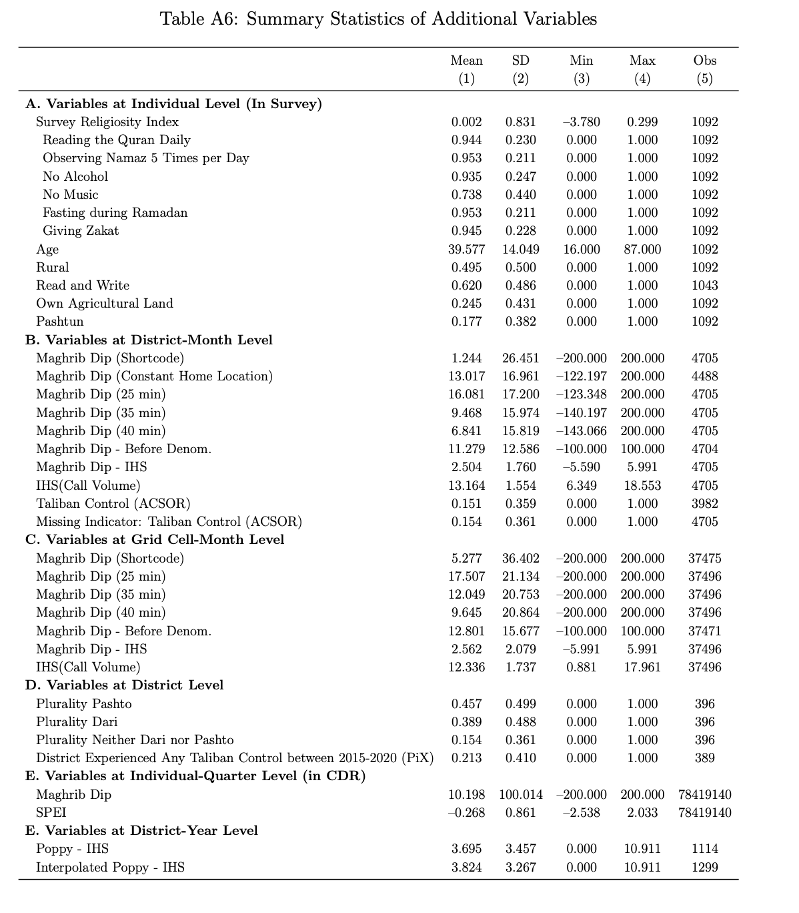

# Paper Identification

|  |   |
| ---  |  -------|
| ID  |   |
| Author  |   |
| Title  |   |
| Iteration |   |

# Summary

 
# General

- [ ] Data Availability and Provenance Statements
  - [x] Statement about Rights - Part 1: Right to use the data (e.g. *did the authors lawfully obtain the data*)
  - [x] Statement about Rights - Part 2: Right to publish the data (e.g. *are human subjects involved and did permission been granted to publish their data?*)
  - [ ] License for Data (optional, but recommended)
  - [x] Details on each Data Source
- [x] Dataset list
- [x] Computational requirements
  - [x] Software Requirements
  - [ ] Controlled Randomness (as necessary)
  - [x] Memory, Runtime, and Storage Requirements
- [ ] Description of programs/code
  - [ ] License for Code (Optional, but recommended) 
- [x] List of tables and programs
- [ ] References (Optional, but recommended) 


# High-level Description of Research Project

*This research project...*

- [x] uses observational data.
- [x] uses *confidential* observational data.
- [ ] uses data generated via experiment or trial by the authors (in field or lab).
  - [ ] For lab experiments: The code to implement the experimental protocol (z-Tree, o-Tree etc) is included in the package.
  - [ ] A PDF copy of IRB approval is contained in the package.
  - [ ] A PDF document outlining the design of the experiment, including information on the selection and eligibility of participants is included.
  - [ ] A PDF copy of the instructions given to participants in both original language and an English translation is included.
- [ ] uses data generated via survey by the authors (in field or online)
  - [ ] The programs used to administer the survey (e.g. qualtrics survey file) are included.
  - [ ] A PDF copy of IRB approval is contained in the package.
  - [ ] A PDF of the original questionaire(s) and information on the selection and eligibility of participants is included.
- [ ] is a simulation study: the data are generated by an algorithm.
- [ ] is a numerical illustration: no data are used but code is used to produce illustrative output (tables, figures)


# Data description

For any data that cannot be provided as part of the replication package, please provide the following information as part of the README.

> {REQUIRED}  Please specify how long the data will be preserved in the restricted-access location.

> {REQUIRED} Please provide affirmation of support for replication checks.
  - As per the [JPE policy](https://jpedataeditor.github.io/policy.html), "In cases where data cannot be published in an openly accessible trusted data repository like the JPE dataverse, authors who have requested an exemption to publish them at the time of first submission must commit to preserving the data and code for a period of no less than five years following the publication of the paper. They should also provide reasonable assistance to requests for clarification and replication."


> {REQUIRED} Please provide a codebook for the data.
  - The codebook should at a minimum describe the variables obtained from the data source, in a manner that will let others verify that they have obtained a substantially similar dataset if successfully obtaining access to the data.


## Data Sources

| source | public | private | DOI/URL | access described | codebook/info | cited README | cited paper |
| ---- | --- | --- | --- | --- | --- | --- | --- |
| Transaction-level CDR: calls, SMS, data usage, shortcode calls | no | no | no | partial: legal agreement and privacy restrictions described, but no access path | partial: synthetic schemas only | no data citation | no data citation |
| Individual-quarter CDR panel | no | no | no | partial: same CDR restrictions | partial: synthetic schema only | no data citation | no data citation |
| Household survey microdata on religious practices | no | no | no | partial: described as confidential; no access path | partial: synthetic schema and aggregate response counts only | no; article only | no; article only |
| Cell tower coordinates / antenna geolocation | no | no | no | partial: confidential/privacy restriction described | partial: synthetic schema only | no data citation | no data citation |
| ISAF SIGACTS violence data | no | yes | yes: [SIGACTS file][sigacts] | public link provided | yes: package codebook and classification crosswalk | yes | yes; URL footnote |
| ERA5-Land-based SPEI climate data | no | no | yes: [ERA5-Land article DOI][era5] | no specific data-access instructions beyond citation | derived variables only | yes | yes |
| MODIS MOD13A3 EVI | no | no | yes: [MODIS data DOI][modis] | public DOI provided | derived variable only | yes | no; paper cites Asher and Novosad method only |
| FAO Afghanistan land cover / irrigation | no | no | yes: [FAO metadata URL][fao] | public URL provided | derived variables only | yes | yes |
| UNODC district-year poppy cultivation | no | no | yes: [UNODC report URL][unodc] | report URL provided | derived variables only | yes | yes |
| ACSOR district accessibility scores | no | no | yes: [ACSOR homepage][acsor] | no dataset-specific access conditions; homepage only | derived variables only | yes | yes |
| PIX Taliban territorial-control data | no | no | yes: [PIX][pix] | URL resolves to a login page | derived variable only | yes | yes |
| Village-level language / ethnicity data compiled by AIMS, CSO, USAID, and Yale | no | no | no | no access conditions | derived variables only | no data citation | partial: source named, no data citation |
| AIMS Afghanistan district boundaries | yes: `Data/figures_data/district_shp/district398.*` | no | no author-provided URL | no access conditions | no package codebook entry for shapefile attributes | no data citation | no data citation |
| GADM country boundary and derived grid/raster/crosswalk components | partial: GADM country boundary and `rasterwithmask.nc` included; cell-district crosswalk not separate | no | yes for GADM source: [GADM v3.6][gadm36] | no package-specific access conditions | no package codebook entry for shapefile/raster attributes | no data citation | no data citation |

Shortcomings: the original CDR, individual-quarter CDR panel, household survey microdata, and cell tower coordinates are not available to the replicator; only synthetic stand-ins or aggregate derivatives are included. The codebook documents distributed files and derived variables, but not enough original-source detail to verify the confidential data if access were later granted. The package also does not provide a codebook entry for the included shapefiles or `rasterwithmask.nc`. No datasets are provided, including public ones.

[sigacts]: https://github.com/knapply/data4ds4da/blob/master/data/sigacts_afghanistan_df.rda
[era5]: https://doi.org/10.5194/essd-13-4349-2021
[modis]: https://doi.org/10.5067/MODIS/MOD13A3.061
[fao]: https://data.apps.fao.org/map/catalog/srv/eng/catalog.search?id=1289#/metadata/1dd35e22-bd51-4c4d-bf0c-546baababe74
[unodc]: https://www.unodc.org/documents/crop-monitoring/Afghanistan/20210217_report_with_cover_for_web_small.pdf
[acsor]: https://acsor-surveys.com/
[pix]: https://pixtoday.net
[gadm36]: https://gadm.org/download_country_v3.html

# Requirements 

- [x] README is in TXT, MD, or PDF format
- [x] README is accessible at the root of the package (not inside a folder)
- [ ] Title conforms to guidance (starts with "Data and Code for: Title of Paper" or "Code for: Title of Paper", is properly capitalized)
- [ ] Authors (with affiliations) are listed in the same order as on the paper

> {REQUIRED} Please review the title of the deposit as per our guidelines.

> {REQUIRED} Please review authors and affiliations on the deposit. In general, they are the same, and in the same order, as for the manuscript; however, authors can deviate from that order.

## Stated Requirements

- [ ] No requirements specified
- [x] Software Requirements specified as follows:
  - StataNow 19.5 SE
  - R 4.40
  - Quarto > 1.4
  - Python 3.10.x
- [x] Computational Requirements specified as follows:
  - Windows 11 Enterprise; Intel Core i7-12700H (20 logical cores); 16 GB RAM. 
  - For the CDR pipeline "Requires a secure high-memory server; not executable without the confidential CDR data.""
- [x] Time Requirements specified as follows:
  - To compute the _reproducible_ analysis  ~9mn  
  - To compute the _entire_ analysis ~ weeks  

- [x] Requirements are complete.

# Analyzing Data and Code Files











## Code description

The package contains 19 cleaning programs (12 Python, two R, and five Stata) and 12 analysis programs (10 R, one Stata, and one Quarto). `13_precleaning_alltables.do` creates seven analysis datasets. `All_Tables.do` generates Tables 1--3 and A1--A12/A14; `TabA13.R` generates Table A13. `All_Figures.R` calls the programs for Figures 1--4 and A3--A6, while Figure A2 must be rendered separately. The detailed program and line-number crosswalk is in [package-output-map.xlsx](package-output-map.xlsx).

Shortcomings identified during code review:

- Eighteen of the 19 cleaning programs contain only NUL bytes and therefore cannot be reviewed. The only readable cleaning program is `13_precleaning_alltables.do`.
- `Fig1.R` also contains only NUL bytes, so the code producing Figure 1 cannot be identified.
- No program was provided for Figure A1.
- There is no single controller for every output: Figure A2 and Table A13 are outside the figure and table controllers, respectively.
- Figure A2, Tables A2--A3, and Table A13 use synthetic data or placeholder inputs rather than the original confidential data.
- Several substantive in-text numerical claims are not generated by identifiable code; these are listed separately in `package-output-map.xlsx`.



- [ ] The replication package contains a "main" or "master" file(s) which calls all other auxiliary programs.

> NOTE: In-text numbers that reference numbers in tables do not need to be listed. Only in-text numbers that correspond to no table or figure need to be listed.

## Computing Environment of the Replicator

MacBookPro M4Pro 24Go RAM

- Stata/MP 19.5 
- R 4.5.1
- Python 3.14.2

# Replication


I downloaded the code from GitHub and added the data from Dropbox, but there is an issue in the zipped replication package which contains two zipped subfolders : `Fengzhe Liu - replication package` and `Fengzhe Liu - replication package_20260529`. The first package contains the codebook and paper and appendix in pdf, I then assumed it was the correct one. 

To generate output you need to update the subsequent files with the replication package location : 
- `Code/Analysis/All_Tables.do`
- `Code/Analysis/TabA13.R`
- `FigA2.qmd`

The replication for Stata was impossible due to the bad formating of the `dta` files. It may be due to the facts that stata does not support empty datasets.

`file /Users/REPLICATOR/JPE/dube/JPE-Dube-20250296/replication-package/replication package/Data/tables_data/dist_level.dta not Stata format`

Similar issue for the R code : 

```r
df_panel = fread(paths[['hashQtrPanel']])
Error in `fread()`:
! Input is empty or only contains BOM or terminal control characters
```

For the Quarto Notebook the error stems from the shapefile format that seems corrupted: 

```r
Cannot open "/Users/REPLICATOR/JPE/dube/JPE-Dube-20250296/replication-package/replication package 2/Data/figures_data/country_shp/gadm36_AFG_0.shp"; The source could be corrupt or not supported. See `st_drivers()` for a list of supported formats.
```

# Findings {#sec-findings}

Not able to reproduce code due to bad formatting of databases or total absence of data. 

> The replication for Stata was impossible due to the bad formating of the `dta` files. It may be due to the facts that stata does not support empty datasets.

`file /Users/REPLICATOR/JPE/dube/JPE-Dube-20250296/replication-package/replication package/Data/tables_data/dist_level.dta not Stata format`

> Similar issue for the R code : 

```r
df_panel = fread(paths[['hashQtrPanel']])
Error in `fread()`:
! Input is empty or only contains BOM or terminal control characters
```

> For the Quarto Notebook the error stems from the shapefile format that seems corrupted: 

```r
Cannot open "/Users/REPLICATOR/JPE/dube/JPE-Dube-20250296/replication-package/replication package 2/Data/figures_data/country_shp/gadm36_AFG_0.shp"; The source could be corrupt or not supported. See `st_drivers()` for a list of supported formats.
```
There is a mistake in numbering in table A6, the letter E is duplicated:



## Missing Requirements

Since the code does not run, I was not able to test whether any requirements are missing.
 
## Data Preparation Code

Data preparation is not possible since we cannot have access to the confidential data.

## Tables and Figures

| Data Preparation Program                                           | Dataset created                                | Line Number | Reproduced? |
| ------------------------------------------------------------------ | ---------------------------------------------- | ----------- | ----------- |
| Code/Cleaning/01_antenna_tower_griddist_mapping.R                  | Not identifiable: file contains only NUL bytes |             |             |
| Code/Cleaning/02_gen_tower_maghrib_and_sunset_time.py              | Not identifiable: file contains only NUL bytes |             |             |
| Code/Cleaning/03_gen_compressed_panel.py                           | Not identifiable: file contains only NUL bytes |             |             |
| Code/Cleaning/04_gen_outage_ind.py                                 | Not identifiable: file contains only NUL bytes |             |             |
| Code/Cleaning/05_gen_towerday_indicators_panel.py                  | Not identifiable: file contains only NUL bytes |             |             |
| Code/Cleaning/06_gen_hash_towerday_panel.py                        | Not identifiable: file contains only NUL bytes |             |             |
| Code/Cleaning/07_panel_gridmonth_or_districtmonth.py               | Not identifiable: file contains only NUL bytes |             |             |
| Code/Cleaning/08_01_gen_hash_homelocations.py                      | Not identifiable: file contains only NUL bytes |             |             |
| Code/Cleaning/08_02_gen_hash_districtmonth_continuity_ind.py       | Not identifiable: file contains only NUL bytes |             |             |
| Code/Cleaning/08_03_panel_gridmonth_or_districtmonth_restricted.py | Not identifiable: file contains only NUL bytes |             |             |
| Code/Cleaning/09_01_gen_hash_level_relig.py                        | Not identifiable: file contains only NUL bytes |             |             |
| Code/Cleaning/09_02_gen_init_hash_relig.py                         | Not identifiable: file contains only NUL bytes |             |             |
| Code/Cleaning/09_03_gen_hashqtr_panel.py                           | Not identifiable: file contains only NUL bytes |             |             |
| Code/Cleaning/10_SIGACTS_merge_cdr.R                               | Not identifiable: file contains only NUL bytes |             |             |
| Code/Cleaning/11_01_220805_create_master.do                        | Not identifiable: file contains only NUL bytes |             |             |
| Code/Cleaning/11_02_220824_create_master_shortcode.do              | Not identifiable: file contains only NUL bytes |             |             |
| Code/Cleaning/11_03_250108_update_master_cdr.do                    | Not identifiable: file contains only NUL bytes |             |             |
| Code/Cleaning/12_240213_gen_widewheat_panel.do                     | Not identifiable: file contains only NUL bytes |             |             |
| Code/Cleaning/13_precleaning_alltables.do                          | cdr_and_conflict_dm.dta                        | 266         |             |
| Code/Cleaning/13_precleaning_alltables.do                          | cdr_and_climate_gm.dta                         | 530         |             |
| Code/Cleaning/13_precleaning_alltables.do                          | cdr_and_climate_gy.dta                         | 639         |             |
| Code/Cleaning/13_precleaning_alltables.do                          | calls_shortcode_comparison_dm.dta              | 677         |             |
| Code/Cleaning/13_precleaning_alltables.do                          | calls_shortcode_comparison_gm.dta              | 706         |             |
| Code/Cleaning/13_precleaning_alltables.do                          | dist_level.dta                                 | 910         |             |
| Code/Cleaning/13_precleaning_alltables.do                          | grid_level.dta                                 | 922         |             |

| Figures/Tables | Code        | Line     |  			
| --------- | --------------------------- | -------------------------------------------------- |  
| Figure 1  | Code/Analysis/Fig1.R        | Not identifiable: file contains only NUL bytes     |  
| Figure 2  | Code/Analysis/Fig2.R        | 114, 246                                           |  
| Figure 3  | Code/Analysis/Fig3.R        | 119                                                |  
| Figure 4  | Code/Analysis/Fig4.R        | 150                                                |  
| Figure A1 | No program provided         | Not identified                                     |  
| Figure A2 | Code/Analysis/FigA2.qmd     | 84 (synthetic tower data)                          |  
| Figure A3 | Code/Analysis/FigA3.R       | 75                                                 |  
| Figure A4 | Code/Analysis/FigA4.R       | 70-72                                              |  
| Figure A5 | Code/Analysis/FigA5.R       | 219-223, 231-235                                   |  
| Figure A6 | Code/Analysis/FigA6.R       | 125                                                |  
| Table 1   | Code/Analysis/All_Tables.do | 145                                                |  
| Table 2   | Code/Analysis/All_Tables.do | 203                                                |  
| Table 3   | Code/Analysis/All_Tables.do | 291                                                |  
| Table A1  | Code/Analysis/All_Tables.do | 333                                                |  
| Table A2  | Code/Analysis/All_Tables.do | 432, 441, 448, 454, 460, 466, 472 (synthetic data) |  
| Table A3  | Code/Analysis/All_Tables.do | 508 (synthetic data)                               |  
| Table A4  | Code/Analysis/All_Tables.do | 555                                                |  
| Table A5  | Code/Analysis/All_Tables.do | 629, 642, 650, 661                                 |  
| Table A6  | Code/Analysis/All_Tables.do | 749, 761, 779, 796, 809, 823, 830                  |  
| Table A7  | Code/Analysis/All_Tables.do | 859                                                |  
| Table A8  | Code/Analysis/All_Tables.do | 940                                                |  
| Table A9  | Code/Analysis/All_Tables.do | 996                                                |  
| Table A10 | Code/Analysis/All_Tables.do | 1062                                               |  
| Table A11 | Code/Analysis/All_Tables.do | 1115                                               |  
| Table A12 | Code/Analysis/All_Tables.do | 1162                                               |  
| Table A13 | Code/Analysis/TabA13.R      | 465 (synthetic data)                               |  
| Table A14 | Code/Analysis/All_Tables.do | 1215                                               |  

## In-Text Numbers

- [x] In-text numbers not verified.

- [ ] There are no in-text numbers, or all in-text numbers stem from tables and figures.

- [ ] There are in-text numbers, but they are not identified in the code

| Paper | In-text | code |
|---|---|---|
| Paper PDF p. 2: a one-SD survey religiosity increase is associated with a 27% increase in the Maghrib dip. Later text and Table A2 report 29%. | No code generates the 27% claim | N/A |
| Paper PDF p. 9: 90% of Afghans are Sunni| No package program| N/A |
| Paper PDF p. 20 n. 23: adult literacy rate is 43%. | No package program| N/A |

# Classification

- [ ] full reproduction
- [ ] full reproduction with minor issues
- [ ] partial reproduction (see above)
- [x] not able to reproduce most or all of the results (reasons see above)

## Reason for incomplete reproducibility

- [ ] None.
- [ ] `Discrepancy in output` (either figures or numbers in tables or text differ)
- [ ] `Bugs in code` that were fixable by the replicator (but should be fixed in the final deposit)
- [ ] `Code missing`, in particular if it prevented the replicator from completing the reproducibility check
  - [ ] `Data preparation code missing` should be checked if the code missing seems to be data preparation code
- [ ] `Code not functional` is more severe than a simple bug: it prevented the replicator from completing the reproducibility check
- [ ] `Software not available to replicator` may happen for a variety of reasons, but in particular (a) when the software is commercial, and the replicator does not have access to a licensed copy, or (b) the software is open-source, but a specific version required to conduct the reproducibility check is not available.
- [ ] `Insufficient time available to replicator` is applicable when (a) running the code would take weeks or more (b) running the code might take less time if sufficient compute resources were to be brought to bear, but no such resources can be accessed in a timely fashion (c) the replication package is very complex, and following all (manual and scripted) steps would take too long.
- [x] `Data missing` is marked when data *should* be available, but was erroneously not provided, or is not accessible via the procedures described in the replication package
- [x] `Data not available` is marked when data requires additional access steps, for instance purchase or application procedure. 
- [ ] `Missing README` is marked if there is no README to guide the replicator, or the README is not in compliance with JPE requirements

